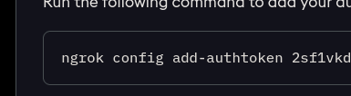
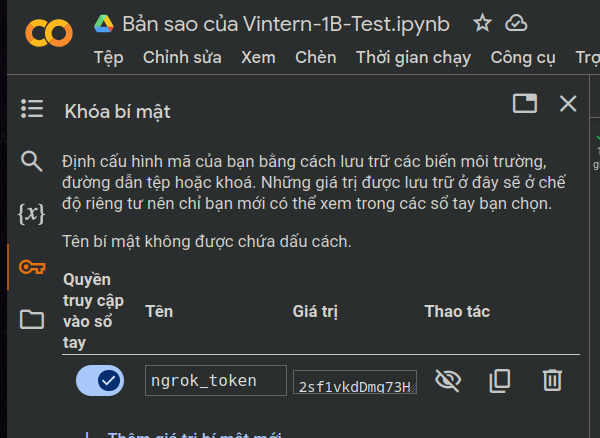
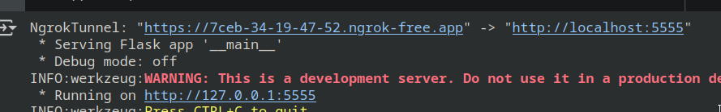

## How it work?

Diff a hardsubbed video with video that is not hardsubbed to detect subtitle frames.
Extract these frames as images and OCR them using Google Lens.
Integrate the resulting text into an SRT subtitle file.

## Accuracy

Guess this :)

## Setup

Step 1: Install Python

Step 2: Install VapourSynth

```sh
# For Arch Linux:
yay -S vapoursynth ffmpeg
```

Step 3:

```sh
git clone https://github.com/boydaihungst/OCR_LLM
cd ./OCR_LLM
```

Step 4: Create the Virtual Environment

```sh
python -m venv .venv
```

Step 5: Activate the Virtual Environment

```sh
# for fish shell
. .venv/bin/activate.fish

# bash shell
. .venv/bin/activate

# window cmd
.venv\Scripts\activate

# window powershell
Set-ExecutionPolicy Unrestricted -Scope Process
.venv\Scripts\Activate.ps1

```

Step 6: Install python libraies
`pip install -r requirements.txt`

Step 7: Install vapoursynth plugins

```sh
# For windows:
git clone https://github.com/vapoursynth/vsrepo
python ./vsrepo/vsrepo.py install acrop hysteresis lsmas misc tcanny tedgemask resize2 imwri

# For Arch linux
yay -S vapoursynth-plugin-imwri-git vapoursynth-plugin-lsmashsource-git vapoursynth-plugin-misc-git vapoursynth-plugin-resize2-git vapoursynth-plugin-tcanny-git vapoursynth-plugin-tedgemask-git
python ./vsrepo/vsrepo.py install hysteresis
# copy hysteresis plugin to shared lib folder
sudo cp -R ~/.local/lib/vapoursynth/*.so /usr/lib/vapoursynth/
# The following commands to build acrop plugin
git clone https://github.com/Irrational-Encoding-Wizardry/vapoursynth-autocrop
# Link C interfaces to build acrop
cp -lR /usr/include/vapoursynth/*.h ./vapoursynth-autocrop/
# Build and install acrop plugin
g++ -std=c++11 -shared -fPIC -O2 ./autocrop.cpp -o /usr/lib/vapoursynth/libautocrop.so
```

## Usage

### Prepare two media sources.

- Muse HardSubed from YouTube, should choose 720p AVC format.
- Non HardSubed, should be the same resoluion with HardSubed source. Higher resolution will take a longer time to process.

Two sources must be synchronized. If not, adjust offset arguments.

### Create LLM from google colab

- Get ngrok auth token: [https://dashboard.ngrok.com/get-started/setup](https://dashboard.ngrok.com/get-started/setup)
  The token is behind `add-authtoken`
  

- Clone this google colab and enter `ngrok_token` like below:
  [https://colab.research.google.com/drive/1Xn-q1l9UJprfNUqKGbs49ss-qdVWq1V5?usp=sharing](https://colab.research.google.com/drive/1Xn-q1l9UJprfNUqKGbs49ss-qdVWq1V5?usp=sharing)

  

  Then Start collab step by step from top to bottom.
  The last step won’t show a finished status. As long as you see this message, it’s working fine.
  The `llm-api` = `https://7ceb-34-19-47-52.ngrok-free.app/ocr`
  

### Step to OCR

```sh
# Active python virtual environment
# Follow Step 5: Activate the Virtual Environment, then run the command below to ocr
# The api url is from google colab
# Any media extensions should works (mp4, mkv, ts, etc)
python ocr.py clean.mkv sub.ts --llm-api "https://7ceb-34-19-47-52.ngrok-free.app/ocr"
```

For more.

```sh
python ocr.py --help
```

For non-Muse sources, it is necessary to adjust the crop parameters to an subtitles area, also may need to adjust SceneDetect threshold.

If two sources is hard to sync, then use VSF instead to generate clear images then put it into `images` folder. After that use this tool with `--no-filter` args.

## TODO

Rewrite this spaghetti.

## Acknowledgement

- [VapourSynth](https://www.vapoursynth.com/doc/index.html)
- [JET](https://github.com/Jaded-Encoding-Thaumaturgy)
- [image-ocr-google-docs-srt](https://github.com/Abu3safeer/image-ocr-google-docs-srt)
- [LunaTranslator](https://github.com/HIllya51/LunaTranslator/blob/main/LunaTranslator/LunaTranslator/ocrengines/googlelens.py)

